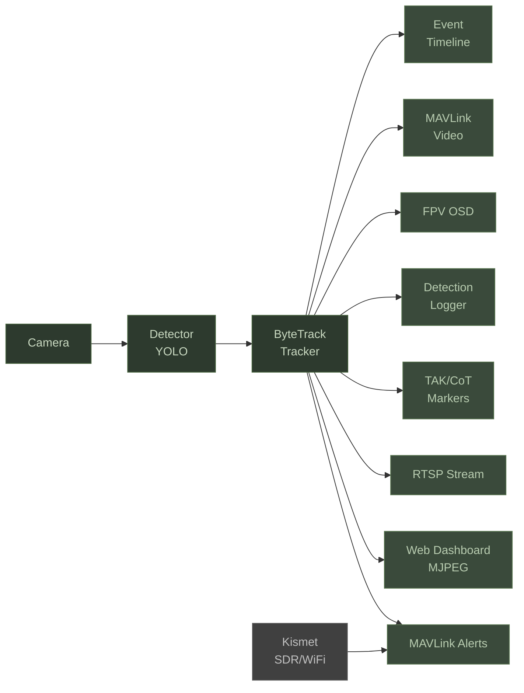

# Hydra Detect v2.0


Real-time object detection and tracking for uncrewed vehicles running ArduPilot. Runs on NVIDIA Jetson Orin Nano. Processes a camera feed through YOLO and ByteTrack, pushes detection data to your GCS over MAVLink. No firmware changes. Drones, boats, rovers.

## Architecture



## Quick Start

**1. Clone and build**

```bash
git clone https://github.com/rmeadomavic/Hydra.git && cd Hydra
docker build --network=host -t hydra-detect .
```

**2. Configure hardware**

Edit `config.ini` — set your camera source and MAVLink connection string. Disable MAVLink for bench testing.

**3. Run**

```bash
docker run --rm --privileged --runtime nvidia --network host \
  -v $(pwd)/config.ini:/app/config.ini \
  -v $(pwd)/models:/models \
  -v $(pwd)/output_data:/data \
  hydra-detect
```

**4. Open the dashboard**

Browse to `http://<jetson-ip>:8080`. Live video with detection overlays.

Or run `bash scripts/hydra-setup.sh` for guided first-time setup.

## Features

| Category | Feature | Detail |
|----------|---------|--------|
| **Operations** | YOLO detection | On-device via CUDA, 5+ FPS on Jetson Orin Nano |
| | ByteTrack tracking | Persistent IDs across frames, handles occlusion |
| | Target lock | Vehicle yaws to keep target centered (Keep in Frame) |
| | Follow / Drop / Strike | Three approach modes with abort at any time |
| | MAVLink alerts | STATUSTEXT with GPS coordinates to Mission Planner / QGC |
| | TAK integration | Detection markers, self-SA, GeoChat command listener |
| | FPV OSD | Detection telemetry on FPV feed (statustext, Lua, MSP DisplayPort) |
| | RF homing | Locate WiFi/SDR sources via Kismet RSSI gradient ascent |
| | Mission profiles | RECON / DELIVERY / STRIKE presets |
| **Output** | Web dashboard | Live MJPEG stream with bounding boxes and HUD |
| | RTSP server | H.264 output for external displays |
| | Instructor page | Multi-vehicle overview with per-vehicle abort |
| | Post-mission review | Map replay with detection markers and track trails |
| | MAVLink video | Detection thumbnails over telemetry radio |
| **Development** | Config schema | Typed validation with plain-English error messages |
| | Chain of custody | SHA-256 hash chain on detection logs |
| | Model manifest | Hash verification for all YOLO model files |
| | Test suite | 50+ pytest files covering all subsystems |
| | SITL mode | Hardware-free testing with ArduPilot simulator |
| | Config freeze | Safety-critical fields locked during active engagement |
| | Audit logging | Structured log of all control actions |

## Vehicle Compatibility

| Feature | Drone | USV (Boat) | UGV (Rover) | Fixed Wing |
|---------|:-----:|:----------:|:-----------:|:----------:|
| Follow mode | ✓ | ✓ | ✓ | ~ |
| Drop mode | ✓ | ✓ | ✓ | ~ |
| Strike mode | ✓ | ✓ | ✓ | — |
| Yaw control | CONDITION_YAW | Rudder | Steering | — |
| Hold mode | LOITER | HOLD | HOLD | LOITER |
| Dogleg RTL | ✓ | — | — | — |
| SmartRTL | ✓ | ✓ | ✓ | ✓ |
| Servo tracking | ✓ | ✓ | ✓ | ✓ |
| RF homing | ✓ | ✓ | ✓ | ✓ |

`✓` supported  `~` limited  `—` not supported

Any ArduPilot vehicle with GUIDED mode works. The system auto-detects the correct hold mode.

## Documentation

| Guide | Description |
|-------|-------------|
| [Getting Started](docs/getting-started.md) | Hardware, setup, first boot, SITL mode |
| [Configuration](docs/configuration.md) | Every config.ini key documented |
| [Dashboard](docs/dashboard.md) | Web UI walkthrough, all pages |
| [Vehicle Control](docs/vehicle-control.md) | Follow, Drop, Strike, mission profiles, abort |
| [Autonomous Operations](docs/autonomous-operations.md) | Safety gates, geofencing, two-stage arm |
| [FPV OSD](docs/fpv-osd.md) | Three OSD modes, wiring, FC setup |
| [RF Homing](docs/rf-homing.md) | Kismet, state machine, gradient ascent |
| [TAK Integration](docs/tak-integration.md) | CoT output, GeoChat commands, callsign routing |
| [Post-Mission Review](docs/post-mission-review.md) | Logs, verification, map replay, export |
| [API Reference](docs/api-reference.md) | Every endpoint documented |
| [Deployment](docs/deployment.md) | systemd, Docker, TLS, multi-Jetson fleet |
| [Development](docs/development.md) | Project layout, testing, extending |

## Dependencies

- Python 3.10+
- OpenCV (CUDA-enabled in Docker, headless for bare metal)
- [ultralytics](https://github.com/ultralytics/ultralytics) (YOLOv8/v11)
- [supervision](https://github.com/roboflow/supervision) (ByteTrack)
- [pymavlink](https://github.com/ArduPilot/pymavlink) + pyserial
- FastAPI + uvicorn
- `mgrs` — military grid coordinates (optional)
- `requests` — Kismet API client (optional)
- GStreamer — RTSP output (optional)
- [Kismet](https://www.kismetwireless.net/) — RF source localization (optional)

Base Docker image: `dustynv/l4t-pytorch:r36.4.0` (CUDA, PyTorch, TensorRT included).
