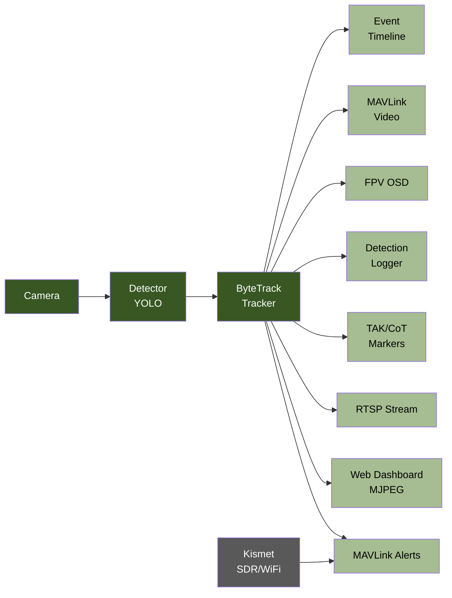

# Hydra Detect v2.0

<!-- TODO: Hero image -- Jetson mounted on USV with camera, SORCC green tint overlay -->


Real-time object detection and tracking payload for uncrewed vehicles running ArduPilot. Runs on NVIDIA Jetson Orin Nano, processes a camera feed through YOLO and ByteTrack, and pushes detection data to your GCS over MAVLink. No firmware changes required. Drones, boats, rovers.

## Architecture



## Quick Start

```bash
git clone https://github.com/rmeadomavic/Hydra.git && cd Hydra
docker build --network=host -t hydra-detect .
docker run --rm --privileged --runtime nvidia --network host \
  -v $(pwd)/config.ini:/app/config.ini -v $(pwd)/models:/models \
  -v $(pwd)/output_data:/data hydra-detect
# Open http://<jetson-ip>:8080
```

Or run the interactive setup: `bash scripts/hydra-setup.sh`

## Features

### Operations (Field Use)

- YOLOv8 detection on-device via CUDA, 5+ FPS on Jetson Orin Nano
- ByteTrack multi-object tracking with persistent IDs
- Target lock with vehicle yaw control (Keep in Frame)
- Follow, Drop, and Strike approach modes
- MAVLink STATUSTEXT alerts with GPS coordinates
- TAK/ATAK integration: detection markers, self-SA, GeoChat commands
- FPV OSD overlay (statustext, Lua named_value, MSP DisplayPort)
- Pre-flight checklist on dashboard load
- Mobile control page for phone operators
- RF source localization via Kismet RSSI gradient ascent
- Mission profiles: RECON, DELIVERY, STRIKE presets

### Demo (Leadership Showcases)

- Web dashboard with live MJPEG stream and bounding boxes
- RTSP output for external displays
- Instructor multi-vehicle overview page
- Post-mission review map with detection markers and track replay

### Development

- Config schema validation with plain-English errors
- SHA-256 chain-of-custody on detection logs
- Model manifest with hash verification
- 50+ pytest test files covering all subsystems
- SITL simulation mode for hardware-free testing
- Config freeze during active engagement
- Structured audit logging for all control actions

## Documentation

| Guide | Description |
|-------|-------------|
| [Getting Started](docs/getting-started.md) | Hardware, setup, first boot, SITL mode |
| [Configuration](docs/configuration.md) | Every config.ini key documented |
| [Dashboard](docs/dashboard.md) | Web UI walkthrough, all pages |
| [Vehicle Control](docs/vehicle-control.md) | Follow, Drop, Strike, mission profiles, abort |
| [Autonomous Operations](docs/autonomous-operations.md) | Safety gates, geofencing, two-stage arm |
| [FPV OSD](docs/fpv-osd.md) | Three OSD modes, wiring, FC setup |
| [RF Homing](docs/rf-homing.md) | Kismet, state machine, gradient ascent |
| [TAK Integration](docs/tak-integration.md) | CoT output, GeoChat commands, callsign routing |
| [Post-Mission Review](docs/post-mission-review.md) | Logs, verification, map replay, export |
| [API Reference](docs/api-reference.md) | Every endpoint documented |
| [Deployment](docs/deployment.md) | systemd, Docker, TLS, multi-Jetson fleet |
| [Development](docs/development.md) | Project layout, testing, extending |

## Vehicle Compatibility

| Feature | Drone | USV (Boat) | UGV (Rover) | Fixed Wing |
|---------|-------|------------|-------------|------------|
| Follow mode | Yes | Yes | Yes | Limited |
| Drop mode | Yes | Yes | Yes | Limited |
| Strike mode | Yes | Yes | Yes | Not recommended |
| Yaw control | CONDITION_YAW | Rudder | Steering | No |
| Hold mode | LOITER | HOLD | HOLD | LOITER |
| Dogleg RTL | Yes | No | No | No |
| SmartRTL | Yes | Yes | Yes | Yes |
| Servo tracking | Yes | Yes | Yes | Yes |
| RF homing | Yes | Yes | Yes | Yes |

Any ArduPilot vehicle with GUIDED mode support works. The system auto-detects the correct hold mode.

## Dependencies

- Python 3.10+
- OpenCV (CUDA-enabled in Docker, headless for bare metal)
- [ultralytics](https://github.com/ultralytics/ultralytics) (YOLOv8/v11)
- [supervision](https://github.com/roboflow/supervision) (ByteTrack)
- [pymavlink](https://github.com/ArduPilot/pymavlink) + pyserial
- FastAPI + uvicorn
- Optional: `mgrs` (military grid coordinates), `requests` (Kismet API)
- Optional: GStreamer + RTSP server (for RTSP output)
- Optional: [Kismet](https://www.kismetwireless.net/) (RF source localization)

Base Docker image: `dustynv/l4t-pytorch:r36.4.0` (CUDA, PyTorch, TensorRT included).
