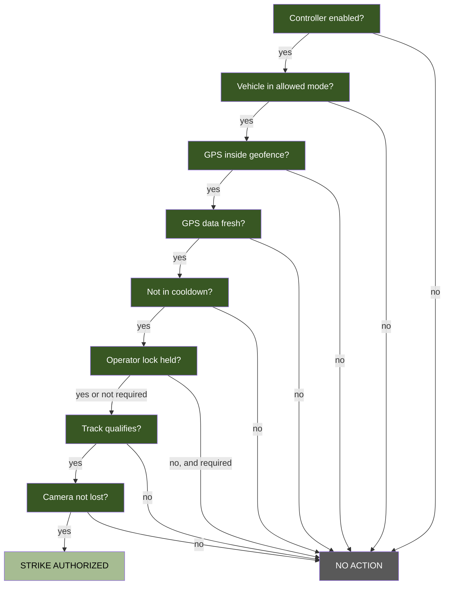

# Autonomous Operations

The autonomous strike controller evaluates targets against a chain of qualification gates. Every gate must pass simultaneously. If any gate fails, the controller takes no action. This is a fail-closed design.

Off by default. Enable with `[autonomous] enabled = true`.

## Safety Gate Chain



## Qualification Gates

### 1. Controller Enabled

`[autonomous] enabled` must be `true`. This is the master switch.

### 2. Vehicle Mode Check

The vehicle must be in one of the modes listed in `allowed_vehicle_modes` (default: `AUTO`). Comma-separated. If the vehicle is in LOITER, STABILIZE, or any other mode not on the list, no autonomous action occurs.

### 3. Geofence Check

The vehicle's GPS position must be inside the configured geofence. Two geofence types:

**Circle geofence**: defined by `geofence_lat`, `geofence_lon`, and `geofence_radius_m`. Distance computed via Haversine formula.

**Polygon geofence**: defined by `geofence_polygon` as `lat,lon;lat,lon;...` vertices. Uses ray-casting point-in-polygon test. When a polygon is configured, it overrides the circle geofence.

If no meaningful geofence is configured (lat/lon both 0.0 and no polygon), the geofence gate still applies. A 0,0 geofence means the vehicle must be at the null island, which effectively disables autonomous action.

### 4. GPS Freshness

GPS data must be newer than `gps_max_stale_sec` (default 2.0 seconds). If the GPS fix is stale (lost satellite lock, telemetry delay), the gate fails. This prevents striking at an outdated position.

### 5. Cooldown

After a strike, the controller waits `strike_cooldown_sec` (default 30 seconds) before evaluating again. This prevents rapid re-engagement on the same target.

### 6. Operator Lock Requirement

When `require_operator_lock = true` (default), an operator must explicitly lock a target before the autonomous controller will strike it. The operator provides target selection. The controller provides timing and safety gates.

When `require_operator_lock = false`, the controller selects its own targets from the class whitelist.

### 7. Track Qualification

A track must satisfy all three criteria:

- **Class whitelist**: the track's label must be in `allowed_classes`. Empty whitelist means fail-closed, no classes qualify.
- **Confidence**: the track's detection confidence must be at or above `min_confidence` (default 0.85).
- **Persistence**: the track must have been seen in at least `min_track_frames` consecutive frames (default 5). This filters transient false positives.

Track persistence is maintained by a frame counter. If a track disappears for even one frame, its counter resets to zero.

### 8. Camera Health

If the camera is lost (no frames for multiple cycles), the autonomous controller is suppressed. It cannot evaluate targets without vision.

## Two-Stage Arm Circuit

Strike mode uses a two-stage arm to prevent accidental engagement:

**Stage 1, Software arm**: a servo channel (`arm_channel`) is set to `arm_pwm_armed` when the approach begins. Set to `arm_pwm_safe` on abort or completion.

**Stage 2, Hardware arm**: an RC channel (`hardware_arm_channel`) is read. The physical switch on the RC transmitter must be in the armed position. Hydra reads, but does not write, this channel.

Both stages must be armed for the strike to proceed. If `arm_channel = 0` and `hardware_arm_channel = 0`, the arm circuit is disabled (no physical safety).

> [!WARNING]
> Deploying autonomous strike without an arm circuit means the only safeguard is the software qualification gates. For any live deployment, configure at least one arm channel.

## Config Freeze During Engagement

While an autonomous evaluation is active or an operator has a target locked, safety-critical config fields are frozen. The config API rejects writes to:

- The entire `[autonomous]` section
- `servo_tracking.strike_channel`, `strike_pwm_fire`, `strike_pwm_safe`, `pan_channel`

This prevents accidental mid-engagement config changes that could alter strike behavior.

## Safety Audit Trail

All autonomous actions are logged to `hydra.audit`:

- Strike evaluations (pass and fail, with reason)
- Gate failures (which gate failed, why)
- Arm state changes
- Cooldown events

The audit log uses structured format: `ts=<time> actor=<source> action=<action> target=<id> outcome=<result>`.

Detection logs include a SHA-256 hash chain for tamper detection. See [Post-Mission Review](post-mission-review.md) for chain-of-custody verification.

## Configuration

```ini
[autonomous]
enabled = true
geofence_lat = 34.05
geofence_lon = -118.25
geofence_radius_m = 200.0
; Or use polygon geofence:
; geofence_polygon = 34.05,-118.25;34.06,-118.25;34.06,-118.24;34.05,-118.24
min_confidence = 0.85
min_track_frames = 5
allowed_classes = boat, buoy
strike_cooldown_sec = 30.0
allowed_vehicle_modes = AUTO
gps_max_stale_sec = 2.0
require_operator_lock = true
arm_channel = 7
arm_pwm_armed = 1900
arm_pwm_safe = 1100
hardware_arm_channel = 8
```
