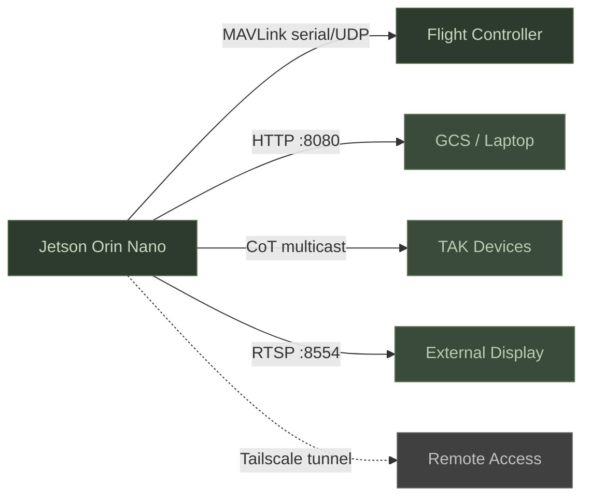

# Deployment

This guide covers production deployment of Hydra on Jetson hardware for field operations.

## Deployment Topology



## systemd Service

The systemd unit file runs Hydra in a Docker container with automatic restart.

```bash
sudo cp scripts/hydra-detect.service /etc/systemd/system/
sudo systemctl daemon-reload
sudo systemctl enable --now hydra-detect
```

The service:
- Starts after Docker and network are ready
- Restarts on failure with 5-second delay
- Uses `--privileged` for device access
- Uses `--network host` for Kismet, MAVLink, and RTSP
- Mounts config.ini, models, output_data, and nvpmodel binaries

View logs:
```bash
journalctl -u hydra-detect -f
```

## Docker Deployment

The Docker image bakes the code into the image. To update code, rebuild:

```bash
# Quick deploy (recommended) — stashes local config changes, pulls, builds, restarts
bash scripts/deploy.sh [branch]

# Manual deploy
cd ~/Hydra
git stash                    # Local config.ini changes WILL block git pull
git pull origin main
sudo docker build -t hydra-detect:latest .
sudo systemctl restart hydra-detect
```

**Important deployment notes:**
- `git pull` will fail if `config.ini` has local changes — always `git stash` first
- `/api/restart` only restarts the detection pipeline, NOT the web server. Code
  changes to `server.py` or JS files require a full Docker rebuild + service restart.
- The container name is `hydra-detect` (not `hydra`). Use `sudo docker rm -f hydra-detect` if needed.
- Wait ~20 seconds after restart for the YOLO model to load before testing.

Key volume mounts:

| Host Path | Container Path | Purpose |
|-----------|---------------|--------|
| `config.ini` | `/app/config.ini` | Configuration |
| `models/` | `/models` | YOLO model files |
| `output_data/` | `/data` | Logs, images, crops |
| `/usr/sbin/nvpmodel` | `/usr/sbin/nvpmodel` | Power mode control |

The Docker HEALTHCHECK hits `GET /api/health` every 15 seconds. Docker marks the container unhealthy if the pipeline stalls.

## Headless Mode

For vehicles with no display attached:

```bash
bash scripts/setup_headless.sh
```

This configures the Jetson to boot without a GUI (multi-user.target), freeing GPU memory for inference.

## Tailscale Remote Access

Access the Jetson dashboard from anywhere via Tailscale:

```bash
bash scripts/setup_tailscale.sh
```

After setup, access the dashboard at `http://<tailscale-ip>:8080`. Tailscale provides encrypted, authenticated access without port forwarding.

Use the Tailscale IP in `[tak] advertise_host` and `[tak] unicast_targets` for remote TAK device connectivity.

## TLS/HTTPS

Enable self-signed TLS for encrypted dashboard access:

```ini
[web]
tls_enabled = true
tls_cert = certs/hydra.crt
tls_key = certs/hydra.key
```

Hydra auto-generates a self-signed certificate if the files do not exist. The certificate is generated with:
- Subject: `CN=hydra-detect/O=SORCC/C=US`
- Validity: 10 years
- Key: RSA 2048-bit

Browsers will show a security warning for self-signed certs. Accept the warning or install the cert on client devices.

## Per-Jetson API Tokens

Each Jetson generates a unique API token on first boot. The token is a 64-character hex string stored in `config.ini [web] api_token`.

To view the token:
```bash
grep api_token config.ini
```

To regenerate:
1. Clear the `api_token` field in config.ini
2. Restart the pipeline
3. A new token is auto-generated and saved

Control endpoints return 401 without a valid token. Read-only endpoints (stats, tracks, health) work without authentication.

## Log Management

### Rotation

Detection logs rotate based on `max_log_size_mb` (default 10 MB). Old files beyond `max_log_files` (default 20) are deleted. Image snapshots follow the same retention policy.

### Application Log

The `hydra.log` file uses Python's RotatingFileHandler: 5 MB per file, 3 backups. Access remotely via:

```bash
curl -s 'http://<ip>:8080/api/logs?lines=100&level=WARNING'
```

### Wipe on Start

For OPSEC, set `[logging] wipe_on_start = true` to delete all previous session data (logs and images) on every pipeline start.

### Export

Download all session data as a ZIP:
```bash
curl -H "Authorization: Bearer <token>" http://<ip>:8080/api/export -o hydra-export.zip
```

## Multi-Jetson Fleet

### Callsign Naming

Each vehicle needs a unique callsign:

```
HYDRA-1-USV
HYDRA-2-DRONE
HYDRA-3-UGV
```

Set in `[tak] callsign` or via the setup wizard. The callsign is used in TAK markers, STATUSTEXT alerts, log file paths, and the dashboard title.

When the callsign differs from `HYDRA-1`, log directories are namespaced: `output_data/HYDRA-2-DRONE/logs/`.

### Instructor Page

The instructor page at `/instructor` on any Hydra instance shows all vehicles on one screen. It polls `GET /api/stats` from each configured Jetson IP. Each card shows callsign, FPS, track count, and an abort button.

The abort button calls `POST /api/abort` on the target Jetson. This endpoint is unauthenticated by design.

CORS headers on `/api/stats` and `/api/abort` allow cross-origin access from the instructor page.

### Code Sync

Push code changes to multiple Jetsons:

```bash
bash scripts/hydra_sync.sh
```

This script syncs the codebase to configured Jetson targets. Each Jetson must rebuild the Docker image for code changes to take effect.

## Golden Image and Factory Reset

### Golden Image

After configuring a Jetson to a known-good state:

1. Update QSPI firmware if needed (see [QSPI Update](setup/jetson-flash.md#step-0-qspi-firmware-update-new-jetsons-only))
2. Flash and configure JetPack 6.x
3. Run `hydra-setup.sh`
4. Build the Docker image
5. Test all subsystems
6. Clone the microSD card or NVMe with `dd` or Etcher

Distribute the cloned image to new Jetsons. Only `config.ini` needs per-vehicle customization (callsign, camera source, serial port).

**Important:** New out-of-box Jetsons must have their QSPI firmware updated before they can boot a JetPack 6.x golden image. See the [QSPI update procedure](setup/jetson-flash.md#step-0-qspi-firmware-update-new-jetsons-only) for the one-card pipeline that handles multiple devices efficiently.

### Factory Reset

Restore the factory defaults:

1. Via API: `POST /api/config/factory-reset` (restores `config.ini.factory` and restarts)
2. Via dashboard: Settings tab, Factory Reset button
3. Via file: `cp config.ini.factory config.ini` and restart the service

The factory file (`config.ini.factory`) is the config.ini shipped with the repository. Keep it unmodified.

## tmux Session

For interactive debugging, use the tmux launcher:

```bash
bash scripts/hydra-launch.sh
```

This starts Hydra in a named tmux session with split panes for the pipeline output and a shell.
