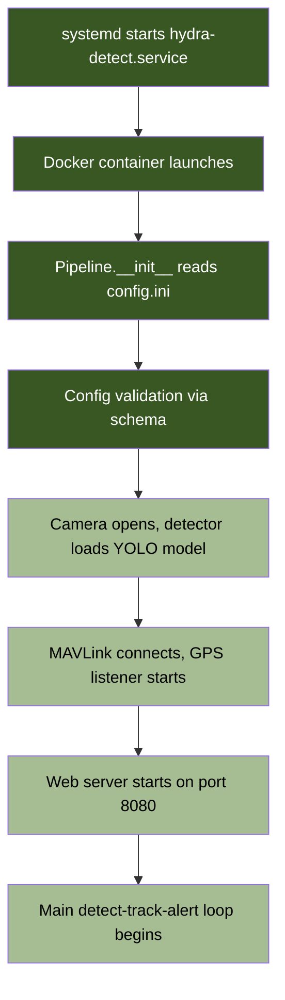

# Getting Started

Hydra Detect runs on NVIDIA Jetson Orin Nano as a companion computer to an ArduPilot flight controller. This guide covers every step from bare hardware to a running detection pipeline.

## Hardware Requirements

| Component | Minimum | Recommended |
|-----------|---------|-------------|
| Companion computer | Jetson Orin Nano 4GB | Jetson Orin Nano 8GB |
| Flight controller | Any ArduPilot FC with GUIDED mode | Pixhawk 6C, Matek H743 |
| Camera | USB webcam (UVC) | Logitech C270/C920, analog via capture card |
| Storage | 32GB microSD | 64GB+ microSD or NVMe |
| MAVLink link | USB serial or UART | Pixhawk TELEM2 via GPIO UART |

> [!TIP]
> The Jetson Orin Nano shares its 4-8 GB RAM between CPU and GPU. Keep this in mind when selecting models. `yolov8n.pt` (nano) fits comfortably. `yolov8s.pt` (small) works on 8GB units.

## Boot Sequence



## Option 1: Automated Setup (Recommended)

After flashing JetPack 6.x on your Jetson, run the interactive setup script:

```bash
git clone https://github.com/rmeadomavic/Hydra.git
cd Hydra
bash scripts/hydra-setup.sh
```

The script handles Docker installation, user group membership, model downloads, config.ini creation, and systemd service setup. It walks through each step interactively.

## Option 2: Docker (Manual)

The Docker image is based on `dustynv/l4t-pytorch:r36.4.0` and ships with CUDA, PyTorch, and TensorRT.

```bash
# Pull the base image (one-time, ~6 GB)
docker pull dustynv/l4t-pytorch:r36.4.0

# Clone and build
git clone https://github.com/rmeadomavic/Hydra.git
cd Hydra
docker build --network=host -t hydra-detect .

# Run
docker run --rm --privileged --runtime nvidia \
  --network host \
  -v $(pwd)/config.ini:/app/config.ini \
  -v /usr/sbin/nvpmodel:/usr/sbin/nvpmodel:ro \
  -v /usr/bin/jetson_clocks:/usr/bin/jetson_clocks:ro \
  -v /etc/nvpmodel.conf:/etc/nvpmodel.conf:ro \
  -v /etc/nvpmodel:/etc/nvpmodel:ro \
  -v /var/lib/nvpmodel:/var/lib/nvpmodel \
  -v $(pwd)/models:/models \
  -v $(pwd)/output_data:/data \
  --name hydra-detect hydra-detect:latest
```

Open `http://<jetson-ip>:8080` in a browser. That is the operator dashboard.

> [!WARNING]
> The `--privileged` flag grants access to all `/dev` devices (cameras, serial ports). This is intentional for field use where device paths vary.

## Option 3: Bare Metal

If you prefer running outside Docker:

```bash
sudo apt update && sudo apt install -y python3-pip
sudo usermod -aG dialout $USER  # log out and back in after this

git clone https://github.com/rmeadomavic/Hydra.git
cd Hydra
sudo pip3 install -r requirements.txt

mkdir -p models
wget -P models https://github.com/ultralytics/assets/releases/download/v8.2.0/yolov8n.pt

nano config.ini  # set camera source and MAVLink connection
sudo python3 -m hydra_detect --config config.ini
```

## First Boot and Setup Wizard

On first boot with no API token configured, Hydra serves a setup wizard at `/setup`. The wizard detects available cameras and serial ports, then writes the selections to `config.ini`.

1. Open `http://<jetson-ip>:8080/setup`
2. Select camera source from the detected list
3. Select MAVLink serial port (or leave disconnected for bench testing)
4. Choose vehicle type (drone, usv, ugv, fw)
5. Set team number and callsign (auto-generates `HYDRA-<team>-<type>`)
6. Save. The pipeline restarts with the new config.

After first boot, an API token is auto-generated and saved to `config.ini`. All subsequent control endpoints require this token.

## Pre-flight Checklist

The dashboard shows a pre-flight checklist overlay on load. It checks:

- **Camera**: source open, frames arriving
- **MAVLink**: connection established, heartbeat received
- **GPS**: fix type meets `min_gps_fix` threshold
- **Config**: schema validation passes (no errors)
- **Models**: YOLO model file exists and loads
- **Disk**: sufficient free space for logging

Green means go. Yellow means degraded (works but limited). Red means the subsystem is down.

Access the checklist programmatically via `GET /api/preflight`.

## SITL Simulation Mode

Test Hydra without hardware using ArduPilot SITL:

```bash
python3 -m hydra_detect --config config.ini --sim
```

The `--sim` flag auto-configures:
- Camera source to `sim_video.mp4` (file playback)
- MAVLink to `udp:127.0.0.1:14550`
- Simulated GPS coordinates (configurable)
- Disables OSD, servo tracking, and RF homing

Pair with ArduPilot SITL for full integration testing.

## CLI Options

```
python3 -m hydra_detect [OPTIONS]

  -c, --config PATH       Config file (default: config.ini)
  --vehicle NAME          Vehicle profile: drone, usv, ugv, fw
  --sim                   SITL simulation mode
  --camera-source SOURCE  Override camera (device index, RTSP URL, or file)
```

The `--vehicle` flag activates `[vehicle.<name>]` overrides from config.ini. It can also be set via the `HYDRA_VEHICLE` environment variable.

## Performance Tuning

For best detection throughput on Jetson:

```bash
sudo nvpmodel -m 0       # max performance mode
sudo jetson_clocks        # lock clocks at maximum
```

These reset on reboot. The systemd service runs them automatically if configured in `hydra-setup.sh`.

Target: 5+ FPS sustained on Jetson Orin Nano 8GB with `yolov8n.pt` at 416px inference resolution.
