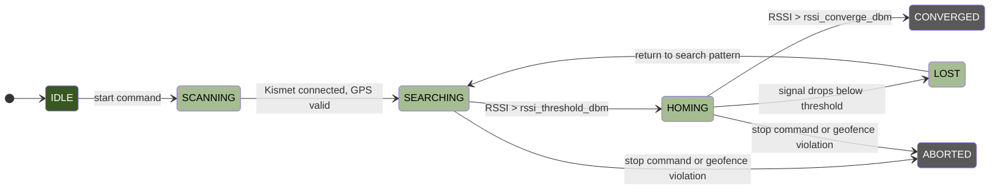

# RF Homing

Hydra can autonomously locate RF signal sources using RSSI gradient ascent. The vehicle flies a search pattern, detects a signal above threshold, then homes in on the strongest signal direction until convergence.

Requires Kismet running on the companion computer with a monitor-mode WiFi adapter or RTL-SDR dongle.

## State Machine



### States

| State | Description |
|-------|-------------|
| IDLE | No hunt active. Waiting for start command. |
| SCANNING | Initializing Kismet connection, validating GPS. |
| SEARCHING | Flying the search pattern (lawnmower or spiral). Polling RSSI. |
| HOMING | Signal detected. Gradient ascent toward the source. |
| CONVERGED | RSSI above convergence threshold. Source located. |
| LOST | Signal dropped below threshold during homing. Returns to search. |
| ABORTED | Hunt stopped by operator or safety violation. |

## WiFi Mode

Hunts a specific BSSID (MAC address). Kismet polls the WiFi adapter for signal strength of the target network.

```ini
[rf_homing]
enabled = true
mode = wifi
target_bssid = AA:BB:CC:DD:EE:FF
```

The WiFi adapter must be in monitor mode. Kismet manages this automatically when configured correctly.

## SDR Mode

Hunts a specific radio frequency. Uses an RTL-SDR dongle via Kismet or rtl_power for signal strength measurement.

```ini
[rf_homing]
enabled = true
mode = sdr
target_freq_mhz = 915.0
```

## Search Patterns

Two search patterns are available. Both generate a grid of waypoints centered on the vehicle's position at hunt start.

### Lawnmower

Parallel legs with spacing between them. Covers a rectangular area systematically. Best for large, open areas.

```
→→→→→→→→→→→
            ↓
←←←←←←←←←←←
↓
→→→→→→→→→→→
```

### Spiral

Expanding outward spiral from center. Good for when the source is expected near the start position.

```
    ↓←←←←
    ↓    ↑
    →→→→→↑
```

Both patterns use `search_area_m` for total area size and `search_spacing_m` for leg separation. Altitude is fixed at `search_alt_m`.

## Gradient Ascent Navigator

Once RSSI exceeds `rssi_threshold_dbm`, the controller switches from search pattern to gradient ascent.

The gradient navigator:

1. Records current RSSI at the current position
2. Moves `gradient_step_m` metres in the current heading
3. Samples RSSI again
4. If signal improved, continue in the same direction
5. If signal dropped, rotate by `gradient_rotation_deg` and try again
6. Repeat until RSSI exceeds `rssi_converge_dbm`

RSSI values are smoothed using a sliding window average (`rssi_window` samples) to reduce noise.

## Geofence Integration

If an autonomous controller is configured, the RF hunt respects its geofence. All waypoints are validated against the geofence boundary before being sent to the vehicle.

- Waypoints outside the geofence are clipped to the nearest point inside the boundary
- If the vehicle would exit the geofence during gradient ascent, the waypoint is adjusted
- A geofence violation aborts the hunt

This uses the same geofence check functions as the autonomous controller: circle (Haversine) or polygon (ray-casting).

## Kismet Integration

Hydra communicates with Kismet via its REST API. The `KismetManager` handles:

- Auto-spawning Kismet if `kismet_auto_spawn = true`
- Authentication (Kismet 2025+ requires API key auth)
- Capture file management (bounded by `kismet_max_capture_mb`)
- Clean shutdown of Kismet processes

The `KismetClient` polls for RSSI data at `poll_interval_sec` intervals.

## Web Dashboard Controls

The RF hunt panel on the Operations tab provides:

- Start/stop hunt buttons
- Mode selection (WiFi/SDR)
- Target entry (BSSID or frequency)
- Search pattern selection
- RSSI history graph
- Current state display
- Waypoint count

API endpoints: `GET /api/rf/status`, `GET /api/rf/rssi_history`, `POST /api/rf/start`, `POST /api/rf/stop`.

## Configuration Reference

See the `[rf_homing]` section in [Configuration](configuration.md#rf_homing).

Key parameters to tune for your environment:

| Parameter | Guidance |
|-----------|----------|
| `rssi_threshold_dbm` | Set above your noise floor. -80 dBm is a good start for WiFi. |
| `rssi_converge_dbm` | Set to expected RSSI at the source. -40 dBm means you are very close. |
| `gradient_step_m` | Smaller steps give more precision but take longer. 5m is a good default. |
| `search_area_m` | Size of the search area. Start with 100m and expand if needed. |
| `search_spacing_m` | Closer spacing finds weaker signals but takes longer. 20m for WiFi. |
| `poll_interval_sec` | How often to sample RSSI. 0.5s is responsive without overloading Kismet. |
