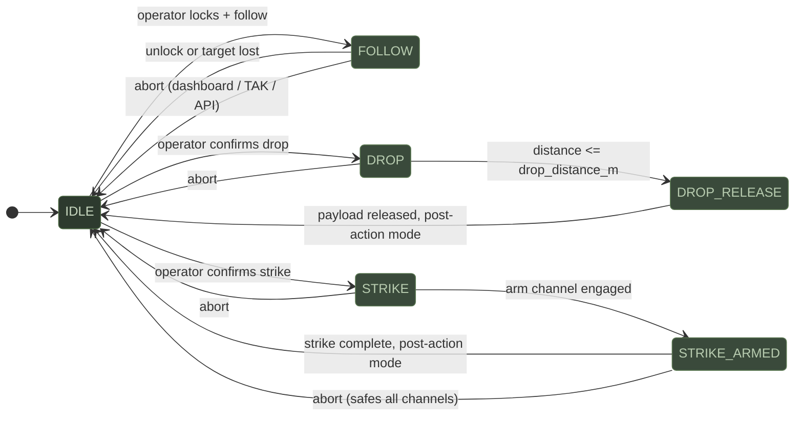

# Vehicle Control

Hydra controls ArduPilot vehicles through MAVLink GUIDED mode commands. All vehicle control requires a MAVLink connection and GPS fix. The system never modifies firmware or parameters, only sends commands.

## Approach Controller State Machine



> **⚠️ Safety: GCS Always Wins**
>
> Changing flight mode from your GCS immediately overrides Hydra. Hydra never
> holds exclusive control. The RC transmitter kill switch works at all times.

## Follow Mode

Follow mode keeps the vehicle tracking a target with continuous waypoint updates. The vehicle stays in GUIDED mode and adjusts speed based on the target's position in the frame.

**Speed scaling**: When the target is centered, the vehicle moves at `follow_speed_max`. When the target drifts toward the frame edge, speed drops to `follow_speed_min`. This keeps the target in the camera's field of view.

**Waypoint projection**: Every `waypoint_interval` seconds (default 0.5), Hydra computes a waypoint `follow_distance_m` metres ahead along the target's estimated bearing from the vehicle.

**Yaw control**: The vehicle yaws to keep the target centered. The maximum yaw rate is bounded by `follow_yaw_rate_max`.

**Exit conditions**:
- Operator unlocks the target
- Target track is lost (no matching track ID)
- Operator triggers abort

### Configuration

```ini
[approach]
follow_speed_min = 2.0       ; m/s at frame edge
follow_speed_max = 10.0      ; m/s when centered
follow_distance_m = 15.0     ; waypoint projection distance
follow_yaw_rate_max = 30.0   ; max yaw rate deg/s
waypoint_interval = 0.5      ; seconds between waypoint sends
```

## Drop Mode

Drop mode approaches a target's GPS position and releases a payload when within `drop_distance_m`.

**Approach**: The vehicle flies toward the target position using GUIDED waypoints.

**Release sequence**:
1. Vehicle reaches `drop_distance_m` from target
2. Drop servo channel pulses to `pwm_release` for `pulse_duration` seconds
3. Servo returns to `pwm_hold`
4. Vehicle transitions to post-drop mode (SMART_RTL for boats/rovers, DOGLEG_RTL for drones)

**Confirmation**: Drop mode requires `confirm: true` in the API request body.

### Configuration

```ini
[drop]
enabled = true
servo_channel = 6            ; servo output channel (0 = disabled)
pwm_release = 1900           ; PWM to release
pwm_hold = 1100              ; PWM to hold
pulse_duration = 1.0         ; seconds at release PWM
drop_distance_m = 3.0        ; release distance from target
```

## Strike Mode

Strike mode is a continuous approach. The vehicle drives directly toward the target. This is the highest-consequence mode.

**Two-stage arm circuit**: Strike requires both a software arm (servo channel) and optionally a hardware arm (RC switch channel). The software arm engages when the approach starts. The hardware arm must already be in the armed position (read from the RC channel). If either stage is not armed, the strike does not proceed.

**Continuous approach**: Unlike follow mode, strike does not maintain distance. It sends waypoints directly at the target position.

**Post-strike**: After the strike completes, the vehicle transitions to the configured post-action mode:
- Drones: LOITER (default) or DOGLEG_RTL
- USVs: LOITER
- UGVs: HOLD

### Configuration

```ini
[autonomous]
arm_channel = 7              ; software arm servo (0 = disabled)
arm_pwm_armed = 1900
arm_pwm_safe = 1100
hardware_arm_channel = 8     ; RC arm switch channel (0 = disabled)
```

## Mission Profiles

Three presets bundle behavior, approach method, and post-action:

| Profile | Behavior | Approach | Post-Action | Icon |
|---------|----------|----------|-------------|------|
| RECON | follow | gps_waypoint | SMART_RTL | eye |
| DELIVERY | drop | gps_waypoint | SMART_RTL | package |
| STRIKE | strike | gps_waypoint | LOITER | target |

Post-action adjusts per vehicle type:
- DOGLEG_RTL is only available for drones. Other vehicle types fall back to SMART_RTL.
- Strike post-action is HOLD for UGVs, LOITER for everything else.

Select profiles via `POST /api/mission-profiles` or the dashboard profile selector.

## SmartRTL and Dogleg RTL

**SmartRTL**: ArduPilot's breadcrumb return-to-launch. The vehicle retraces its path. Used as the default post-drop mode for USVs and UGVs.

**Dogleg RTL**: A tactical return path that obscures the launch point. The vehicle first flies to an offset waypoint perpendicular to the direct line between current position and home, then continues to home. Drones only.

```ini
[autonomous]
dogleg_distance_m = 200      ; offset distance in metres
dogleg_bearing = perpendicular ; or compass degrees (e.g., 90)
dogleg_altitude_m = 50       ; climb altitude before dogleg
```

The dogleg waypoint is computed by `dogleg_rtl.py`. If the bearing is `perpendicular`, the offset is 90 degrees clockwise from the bearing to home.

## Abort

Abort immediately safes all channels and switches the vehicle to a safe mode. There are three ways to trigger abort:

1. **Dashboard**: abort button in the Operations tab
2. **TAK**: send `HYDRA UNLOCK` via GeoChat (or custom CoT `a-x-hydra-u`)
3. **API**: `POST /api/approach/abort` (authenticated) or `POST /api/abort` (unauthenticated, safety override)

On abort:
- Approach controller returns to IDLE
- Software arm channel is set to safe PWM
- Vehicle switches to `abort_mode` (default: LOITER)
- Strike servo is set to safe PWM
- Event is logged to the audit trail

> [!WARNING]
> The `POST /api/abort` endpoint is intentionally unauthenticated. Any device on the network can abort any vehicle. This is the safety override — range control must be able to abort without configuring tokens first.

## Vehicle Compatibility

| Feature | Drone (ArduCopter) | USV (ArduRover boat) | UGV (ArduRover) | Fixed Wing |
|---------|:------------------:|:--------------------:|:---------------:|:----------:|
| Follow mode | ✓ | ✓ | ✓ | ~ |
| Drop mode | ✓ | ✓ | ✓ | ~ |
| Strike mode | ✓ | ✓ | ✓ | — |
| Yaw control | CONDITION_YAW | Rudder | Steering | — |
| Hold mode | LOITER | HOLD | HOLD | LOITER |
| SmartRTL | ✓ | ✓ | ✓ | ✓ |
| Dogleg RTL | ✓ | — | — | — |
| Servo tracking | ✓ | ✓ | ✓ | ✓ |

`✓` supported  `~` limited  `—` not supported

> [!TIP]
> All vehicle control goes through MAVLink GUIDED mode. If you change the flight mode from your GCS at any time, it immediately overrides Hydra. Hydra never holds exclusive control.
